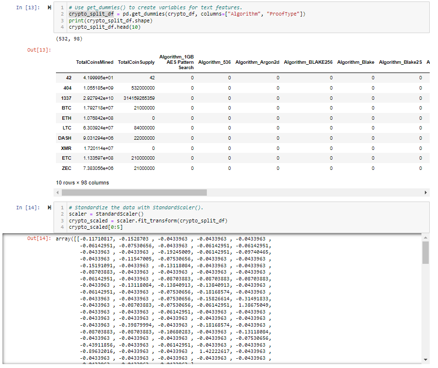
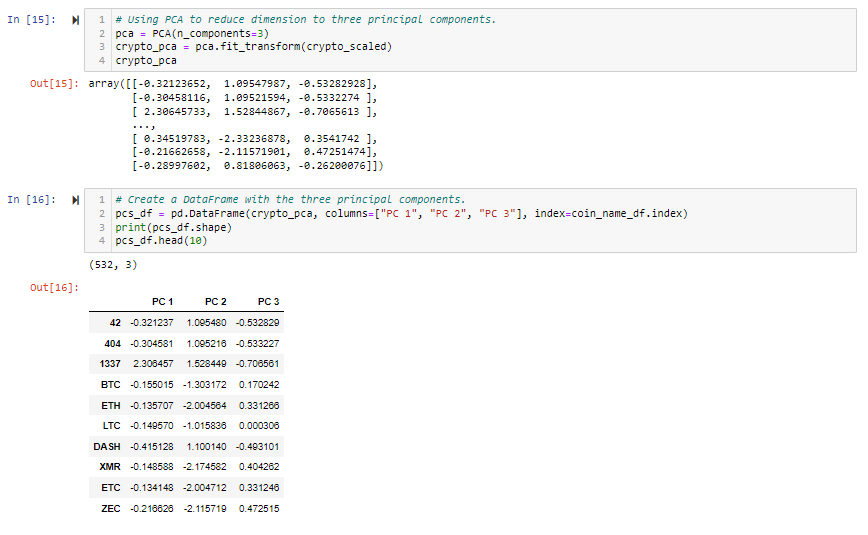
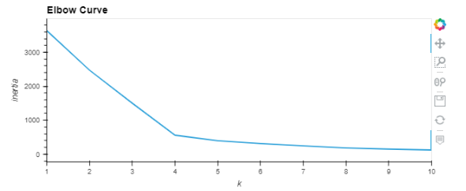
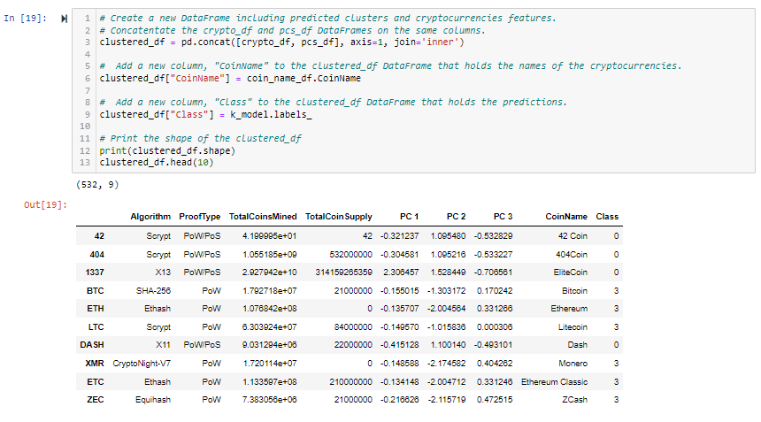
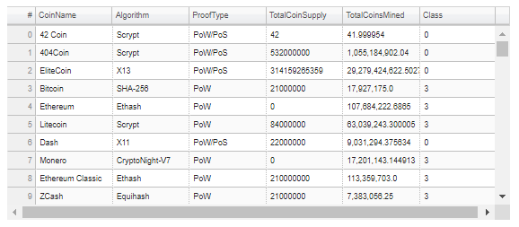
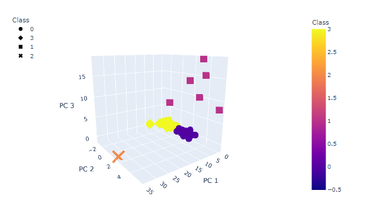
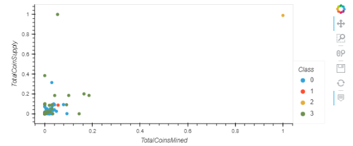

## Overview of Cryptocurrency analysis:

The purpose of this analaysis is to create a report for, Accountability Accounting, a prominent investment bank, looking to get offer a new cryptocurrency portfolio to it's customers. The report provided includes cryptocurency currently being traded on the market and how they can be grouped together to create a classification system for the new investment. 

## Technology Required:
-   Python
    -   Anaconda
    -   Jupyter Notebook
     
-   Libraries
    -   NumPy
    -   SciPy
    -   Scikit-Learn
    -   HVPlot
    -   Plotly

## Results:

Step 1:

    Clean the data by removing uneeded columns, converting all values into integers and finally standardizing the dataset into a usable format.

Step 2:

    Use Principal Component Analysis to reduce the dimensions to 3 principal components.

Step 3: 

    Create an elbow curve and use the KMeans algorithm to predict clusters for the crypto data.

Step 4: 

    Visualize the clustered groups based on the 3 principal components created in step 2 using Plotly and HVPlot.

